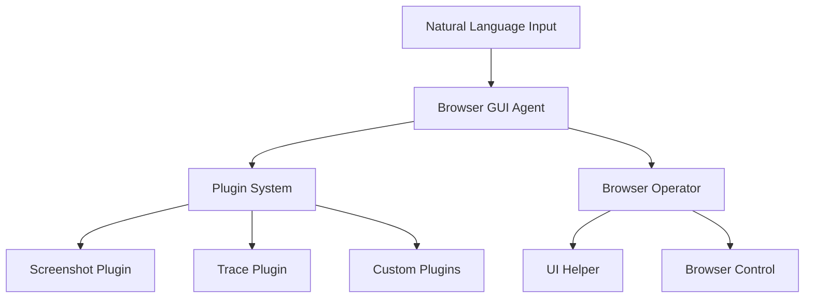

# Browser GUI Agent

A powerful browser automation framework that combines LLM capabilities with precise browser control, enabling natural language task execution through GUI interactions.


## Features

- 🤖 **Natural Language Control** - Execute browser tasks using natural language commands
- 🎯 **Precise GUI Interaction** - Accurate mouse and keyboard control with visual feedback
- 🔌 **Plugin System** - Extensible architecture for custom functionality
- 📊 **Rich Debugging** - Built-in tracing and screenshot capabilities
- 🎨 **Visual Feedback** - Real-time visual indicators for actions
- 🔒 **Type Safety** - Written in TypeScript with full type coverage

## Architecture



## Quick Start

```typescript
import { BrowserGUIAgent } from '@agent-infra/browser-gui-agent';
import { DumpTracePlugin } from '@agent-infra/browser-gui-agent/plugins';

const agent = new BrowserGUIAgent({
  model: {
    baseURL: 'YOUR_MODEL_ENDPOINT',
    apiKey: 'YOUR_API_KEY',
    model: 'YOUR_MODEL_NAME',
  },
  plugins: [new DumpTracePlugin()]
});

await agent.bootstrap();
await agent.run('Search for TypeScript documentation');
await agent.close();
```

## Plugin System

Create custom plugins by implementing the Plugin interface:

```typescript
class MyPlugin implements Plugin {
  name = 'my-plugin';
  
  async onScreenshot(screenshot: ScreenshotOutput) {
    // Handle screenshot
  }
  
  async onAgentData(data: any) {
    // Handle agent data
  }
}
```

## Built-in Plugins

- **DumpTracePlugin**: Generates detailed HTML traces of agent execution
- **LocalScreenshotPlugin**: Saves screenshots locally for debugging

## Development

```bash
# Install dependencies
pnpm install

# Build
pnpm build

# Run example
pnpm run:example

# Run tests
pnpm test
```

## License

MIT

