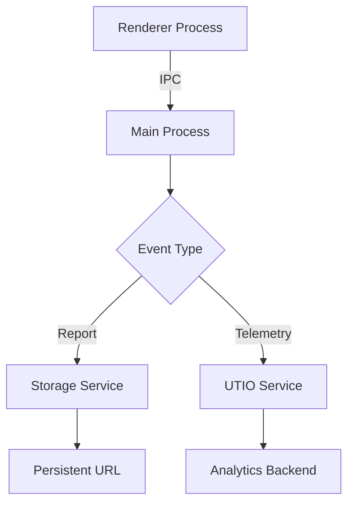

- Start Date: 2025-01-28
- RFC PR: (leave this empty)
- Issue: (leave this empty)

# Summary

This RFC proposes a decoupled data collection architecture for UI-TARS Desktop, introducing two configurable service endpoints:
1. **Report Storage** - For persisting and sharing HTML reports
2. **UTIO** (UI-TARS Insights and Observation) - For collecting operational telemetry

The design enables enterprise users to implement custom backend services while maintaining privacy compliance for open-source users.

# Basic example

Share:

| Get the report link | See the Report |
| --- | --- |
|  |  |

<br>

UITO:

```
13:50:14.863 (main) › [UTIO] payload: {
  type: 'appLaunched',
  platform: 'darwin',
  osVersion: '21.4.0',
  screenWidth: 1728,
  screenHeight: 1117
}

13:51:31.097 (main) › [UTIO] payload: {
  type: 'sendInstruction',
  instruction: 'Send a tweet titled “Hello, GUI Agents!”'
}
```

# Motivation

1. **Decoupled Architecture**: Separate `report storage` from `telemetry collection` to handle different scalability requirements (~30MB HTML reports vs lightweight telemetry events)
2. **Privacy Compliance**: Explicit opt-in design that prevents automatic data collection for open-source users
3. **Enterprise Readiness**: Standardized interfaces for enterprise extensions while maintaining core OSS simplicity


# Detailed design

## Overview

The user needs to explicitly provide the Report Storage Provider and UTIO Provider:

1. **Report Storage Base URL**: The server that stores the Report, accepts the Report File as input, and returns an accessible address;

2. **UTIO Provider** (`UI-TARS Insights and Observation`): Only used for observation data, accepts the key information of this round (Instruction, Report, Snapshot) as input, and does not need to return a value.

The overall life cycle is as follows:


**Why not encapsulate them into a server?**

The reason is that for decoupling, the report file may be very large, and UTIO itself only hopes to solve data statistics problems, not to undertake storage capabilities.

## Architectural Overview


## Core Components

### 1. Report Storage Service
**Endpoint Specification**:
```http
POST /storage HTTP/1.1
Content-Type: multipart/form-data
Authorization: Bearer <token>

------WebKitFormBoundary
Content-Disposition: form-data; name="file"; filename="report.html"
Content-Type: text/html

<HTML content>
------WebKitFormBoundary--
```

**Validation Requirements**:
- File size limit: 30MB
- MIME type: text/html
- Authentication: Bearer token validation

### 2. UTIO Service
**Event Taxonomy**:
```typescript
type TelemetryEvent = 
  | AppLaunchEvent 
  | InstructionEvent 
  | ReportShareEvent;

interface AppLaunchEvent {
  type: 'appLaunched';
  platform: 'Windows' | 'macOS' | 'Linux';
  osVersion: string;
  screenWidth: number;
  screenHeight: number;
}
```

## Electron Process Management
**Main Process Responsibilities**:
1. Centralized network queue management
2. Authentication token storage
3. Error handling and retry logic
4. Lifecycle coordination between renderers

**Renderer Process Constraints**:
- Must use IPC for data transmission
- No direct network access to configured endpoints
- Limited to event generation only

## Cross-Platform Considerations
1. **File System Paths**: Normalize paths between Windows and POSIX systems
2. **Screen Metrics**: Use device-independent pixels for screen dimensions
3. **Certificate Management**: Handle OS-specific TLS certificate chains

# Drawbacks
1. **Main Process Load**: Centralized IPC handling may create bottleneck for high-frequency events
2. **Binary Size Impact**: ~1.2MB increase from network stack dependencies
3. **Security Surface Expansion**:
   - New attack vectors through custom endpoints
   - Bearer token storage in plaintext
4. **Debugging Complexity**: Asynchronous error propagation across processes

# Alternatives
## 1. Unified Service Endpoint
Rejected due to incompatible scaling requirements between large file storage and telemetry collection.

## 2. Renderer Process Execution
Considered but rejected for:
- Inconsistent network handling across webviews
- Security risks from direct renderer network access
- Duplicate authentication logic

## 3. Third-Party Services
Evaluated commercial solutions (Sentry, Mixpanel) but rejected to:
- Maintain vendor neutrality
- Prevent OSS dependency bloat
- Ensure data sovereignty control

# Adoption strategy
1. **Phase 1 (Internal)**:
   - ByteDance internal endpoint rollout
   - Migration guide for existing integrations

2. **Phase 2 (Community)**:
   - Documentation portal with security guidelines
   - Reference implementations for Node.js/Python
   - Sample authentication middleware patterns

3. **Deprecation Timeline**:
   - Legacy analytics system sunset in Q2 2025
   - Dual-system support during transition period

# How we teach this
1. **Workshop Materials**:
   - Secure endpoint configuration tutorial
   - Telemetry schema design best practices

2. **Diagnostic Tools**:
```bash
# Enable debug mode
DEBUG=ui-tars:networking npm start
```

3. **Error Code Taxonomy**:
```markdown
| Code  | Scope           | Resolution                     |
|-------|-----------------|--------------------------------|
| NET-1 | Auth Failure    | Verify token rotation schedule | 
| NET-2 | File Size Limit | Implement client-side truncate |
```

# Unresolved questions
1. **Payload Encryption**: Should we enforce HTTPS for configured endpoints?
2. **Retry Semantics**: Optimal strategy for transient network failures
3. **Data Retention**: Recommended maximum queue time for offline events
4. **Third-Party Audit**: Independent security review requirements